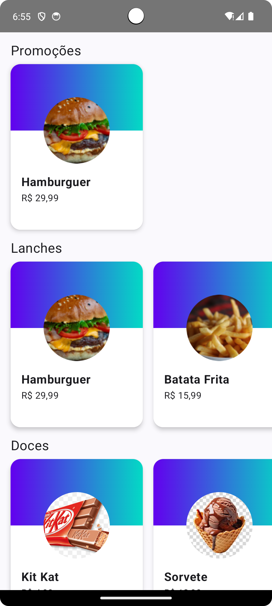
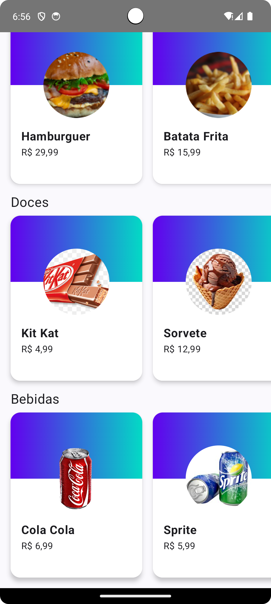

# FORNOW - Aplicativo de Demonstração com Jetpack Compose

Este projeto foi desenvolvido como parte de um curso da <a href="https://www.alura.com.br" target="_blank">Alura</a> para aprender os fundamentos do Jetpack Compose. Ele simula um catálogo de produtos organizados em seções como promoções, lanches, doces e bebidas.

## Funcionalidades

<ul>
  <li>Exibição de produtos organizados por categorias.</li>
  <li>Interface moderna e responsiva utilizando <strong>Jetpack Compose</strong>.</li>
  <li>Design limpo e intuitivo com temas personalizáveis.</li>
  <li>Demonstração de componentes como <code>LazyRow</code>, <code>Column</code> e <code>Surface</code>.</li>
</ul>

## Estrutura do Projeto

### Principais Componentes

- **MainActivity**: Atividade principal que configura o tema e inicia o layout principal.
- **MainLayout**: Componente raiz que organiza as seções de produtos.
- **ProductSectionLayout**: Layout que exibe uma seção de produtos com título e lista horizontal.
- **ProductItemLayout**: Componente individual para exibir informações de um produto.
- **SampleData**: Classe com dados fictícios para teste.
- **ProductModel**: Modelo de dados que representa um produto.
- **Extensão `toBrazilianCurrency`**: Função de extensão para formatar preços no padrão brasileiro.